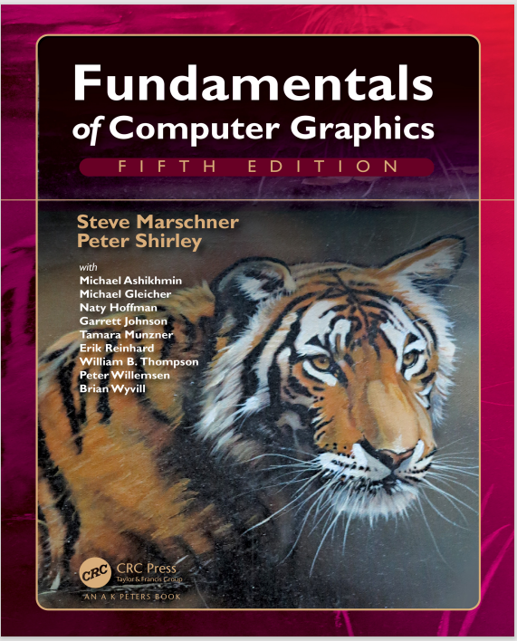

# 第一章 介绍

**此翻译自学使用，才疏学浅，如有错误还望指正。**

***



***

&nbsp;&nbsp;&nbsp;&nbsp;计算机图形学[computer graphics]，描述了任何使用计算机来创建和编辑图像的方法。本书介绍能够用于创造各种图片(真实的视觉效果、信息技术插图、和美丽的计算机动画等)的算法和数学工具。图形学可以是二维或三维的；图像能过够完全的合成或者经由照片制成。本书是关于基础算法和数学的，尤其是使用三维物体和场景合成图像的相关部分。
&nbsp;&nbsp;&nbsp;&nbsp;实际上做图形学相关工作，非常需要关于特定硬件、文件格式、通常还有一两个图形API(见1.3节)的知识。计算机图形学是一个快速发展的领域，所以这些知识的细节是一个不断前进的。因此，本书中我们将尽最大的努力去避免依赖任何特定的硬件或API。鼓励读者为熟悉的软件和硬件环境补充相关文档。幸运的是，计算机图形学的文化有足够的标准术语和概念，本书中的内容应该很好地反应到大多数环境中。
&nbsp;&nbsp;&nbsp;&nbsp;本章定义一些基本术语，提供相关历史背景，以及与图形学相关的信息来源。
***
### 1.1 图形学领域
&nbsp;&nbsp;&nbsp;&nbsp;在任何领域进行分类都是不容易，但多数从事图形研究的业内人士会认同下面几个方向：
- 建模(Modeling) 对各种形状和外观进行数学定义[specification]，并能把信息存储在计算机中
 。例如，咖啡杯可以被描述为一组有序的3维点集，这些三维点能使用插值法则来虎进行连接，还可生成一个用于描述光线如何与杯子相交的反射模型。
- 渲染(Rendering) 渲染是来自艺术领域，用于处理3D计算机模型中生成图像的着色。
- 动画(Animation) 动画是一种通过图像序列来创造运动错觉的技术。动画使用建模和渲染，但添加了随时间移动的关键处理，这在基本建模和渲染中通常不加考虑。
  
&nbsp;&nbsp;&nbsp;&nbsp;还有许多其他领域也涉及到计算机图形学，至于它们是否为图形学的核心领域还有待商榷。这些相关领域在课文中至少会涉及到，包括：
- 用户交互(User interaction) 用户交互处理输入设备(如鼠标和平板电脑)之间的界面、应用程序、以图像形式反馈给用户的展示、以及其他临时反馈。在历史上，这个领域主要与图形学有关，因为图形学研究人员最早使用了输入/输出设备。
- 虚拟现实(Virtual Reality,VR) VR试图让用户沉浸在3D虚拟世界中。这通常需要至少立体图形和对头部运动的响应。对于真实的VR，还应该提供声音和力量反馈。因为这个领域需要先进的3D图形和先进的显示技术，所以经常与图形学紧密关联。
- 可视化(Visualization) 可视化试图通过可视显示让用户了解复杂的信息。在可视化议题中，经常有图形学的问题需要解决。
- 图像处理(Image processing) 图像处理处理的是二维图像的操作，在图形学和视觉领域都有应用。
- 3D扫描(3D scanning) 3D扫描使用测距[range-finding]技术创建可测量3D模型。这样的模型对于创建丰富的视觉图像非常有用，而这些模型的处理通常需要图形算法。
- 计算摄影学(Computational photography) 计算摄影是利用计算机图形学、计算机视觉和图像处理方法来实现摄影捕捉物体、场景和环境的新方法。
***
### 1.2 主要应用
&nbsp;&nbsp;&nbsp;&nbsp;几乎所有行业都可以利用计算机图形，但计算机图形技术的主要用户包括以下行业：
- 电子游戏(Video games) 电子游戏越来越多地使用复杂的3D模型和渲染算法。
- 卡通动画(Cartoons) 动画通常直接由3D模型渲染。许多传统2D动画使用3D模型渲染的背景，这样可以在没有大量艺术家时间的情况下连续移动视点。
- 视觉效果(Visual effects) 视觉效果使用了几乎所有类型的计算机图形技术。几乎每一部现代电影都使用数字合成技术将背景与单独拍摄的前景叠加在一起。许多电影还使用3D建模和动画来创建合成环境、对象，甚至大多数观众永远不会怀疑的非真实人物。
- 动画电影(Animated films) 动画电影使用了许多与视觉效果相同的技术，但并不一定以看起来真实的图像为目标。
- 电脑辅助设计与电脑辅助制造(computer aided design / computer aided manufacturing，CAD/CAM) 该领用利用计算机技术在计算机上设计零件和产品，然后利用这些虚拟设计来指导生产过程。例如，许多机械零件设计在一个三维计算机建模软件包，然后在计算机控制的铣削[milling]设备上自动生产。
- 模拟(Simulation) 模拟可以被认为是更精确的电子游戏。例如，一个飞行模拟器使用复杂的3D图形来模拟驾驶飞机。这种模拟对于安全性要求很高的领域(如驾驶)的初始培训非常有用，对于有经验的用户的情景培训也非常有用(如成本太高及太危险，而无法实际创建的特定消防情况)。
- 医学成像(Medical imaging) 医学成像为扫描的患者数据创建有意义的图像。例如，计算机断层扫描[computed tomography ，CT]数据集由一个大的三维密集阵列组成。计算机图形学用于创建着色图像，帮助医生从这些数据中提取最显著的信息。
- 信息可视化(computed tomography) 信息可视化创建的数据图像不一定具有“自然”的可视化描述。例如，十种不同股票的价格的时间趋势并没有一个明显的可视化描述，但是聪明的图形技术可以帮助人们看到这些数据中的模式。

***
### 1.3 图形API
&nbsp;&nbsp;&nbsp;&nbsp;使用图形库的一个关键部分是使用图形API(应用程序接口)。API是执行一组相关操作的函数的标准集合，而图形API是执行基本操作的函数的集合，如在屏幕上的窗口中绘制图像和3D表面。
&nbsp;&nbsp;&nbsp;&nbsp;每个图形程序都需要能够使用两个相关的API：一个用于可视化输出的图形API和一个用于从用户获取输入的用户界面API。目前有两种主要的图形和用户界面API范例。第一种是集成的方法，以Java为例，其中图形和用户界面工具包是集成的可移植的包，它们是完全标准化的，并且作为语言的一部分受到支持。第二种是由Direct3D和OpenGL表示的，其中绘图命令是与语言(如C++)绑定的软件库的一部分，而用户界面软件是一个独立的实体，可能因系统的不同而不同。在后一种方法中，编写可移植代码是有问题的，尽管对于简单的程序，可以使用可移植库来封装特定于系统的用户界面代码。
&nbsp;&nbsp;&nbsp;&nbsp;无论你选择什么样的API，基本的图形调用大致上都是相同的，本书的概念都适用。

***
### 1.4 图形管线(Graphics Pipeline)
&nbsp;&nbsp;&nbsp;&nbsp;现在的每台台式电脑都有一个强大的3D图形管线[graphics pipeline]。这是一个特殊的的软件/硬件子系统,能高效地在透视图上绘制3D图元[primitives]。通常这些系统都会为处理共享顶点的3D三角形而做优化。管线中的基本操作将3D顶点位置映射到2D屏幕位置，并为三角形着色，使得它们看起来真实，并按照正确的前后顺序显示。
&nbsp;&nbsp;&nbsp;&nbsp;尽管以有效的前后顺序绘制三角形，曾是计算机图形学中最重要的研究方向，但现在几乎都是使用z缓冲区[Z-buffer]来解决，它使用了一种特殊的内存缓冲区来粗暴地解决问题。
&nbsp;&nbsp;&nbsp;&nbsp;事实证明，在图形管线中使用的几何操作几乎可以完全在4D坐标空间中完成，该空间由三个传统几何坐标和第四个齐次坐标(有助于透视)组成。这些4D坐标是用4×4矩阵和思维向量来操作的。因此，图形管线包含许多有效处理和组合这些矩阵和向量的机制。这个4D坐标系是计算机科学中最精巧和最美丽的构造之一，也是学习计算机图形学要跨越的最大障碍[intellectual hurdle]。每本图形学书籍的第一部分都会讨论这些坐标。
&nbsp;&nbsp;&nbsp;&nbsp;生成图像的速度与需要绘制的三角形的数量相关。因为交互性[interactivity]在许多应用程序中比视觉质量更重要，所以要尽量减少用于表示模型的三角形数量。另外，如果在远处观察模型，需要的三角形比从较近距离观察时要少。所以使用多层次细节(level of detail，LOD)来表示模型是非常有效。

***
### 1.5 数值问题
&nbsp;&nbsp;&nbsp;&nbsp;许多图形学程序实际上只是3D数值代码，数值问题通常是至关重要的。在以前，很难以健壮和可移植的方式处理此类问题，因为机器对数字有不同的内部表示，更糟糕的是，处理异常的方式不同且不兼容。幸运的是，几乎所有的现代计算机都符合IEEE浮点标准(IEEE标准协会，1985)。这使得程序员可以对某些数字条件将如何处理，做出许多方便的假设。
&nbsp;&nbsp;&nbsp;&nbsp;虽然IEEE浮点型在编码数值算法时,很有许多有价值的特性，但只有一些特性是非常重要的。首先，也是最重要的一点是，要了解IEEE浮点型中实数有三个“特殊”值：
1. 无穷大[Infinity] ($\infty$) 这是一个大于所有其他有效数字的有效数字。
2. 负无穷大[Minus infinity] ($-\infty$) 这是一个小于所有其他有效数字的有效数字。
3. 非数字[Not a number] (NaN) 这是一个无效的数字，产生于具有未定义结果的操作，例如零除以零。

&nbsp;&nbsp;&nbsp;&nbsp;IEEE浮点型的设计者做了一些对程序员非常方便的决定。其中许多与上述三个特殊值(如:除零)有关。在这些情况下，异常虽然会被记录，但在很多情况下可以忽略。具体地说，对于任何正实数a，以下是被无穷大除法时成立的规则：
$$
\begin{aligned}
+a/(+\infty)&=+0,\\
-a/(+\infty)&=-0,\\
+a/(-\infty)&=-0,\\
-a/(-\infty)&=+0
\end{aligned}
$$
&nbsp;&nbsp;&nbsp;&nbsp;其他涉及无穷大的操作的行为方式与人们预期的一样。同样对于正数a，其行为如下：
$$
\begin{aligned}
\infty+\infty&=+\infty,\\
\infty-\infty&=NaN,\\
\infty * \infty&=+\infty,\\
\infty / \infty&=NaN,\\
\infty / a&=\infty,\\
\infty / 0&=\infty,\\
0 / 0&=NaN
\end{aligned}
$$
&nbsp;&nbsp;&nbsp;&nbsp;涉及到无穷大的布尔表示式规则与期望的一样，具体如下：
1. 所有有限有效数都小于$+\infty$。
2. 所有有限有效数都大于$-\infty$。
3. $-\infty$ 小于 $+\infty$。

&nbsp;&nbsp;&nbsp;&nbsp;涉及具有NaN值的表达式的规则也很简单：
1. 任何包含NaN的算术表达式都会导致NaN。
2. 任何涉及NaN的布尔表达式都是false。

&nbsp;&nbsp;&nbsp;&nbsp;也许IEEE浮点最有用的一点是如何处理被零除的问题；对于任何正实数a，下面涉及到除以零值的规则成立：
$$
\begin{aligned}
+a/+0&=+\infty,\\
-a/+0&=-\infty。
\end{aligned}
$$
&nbsp;&nbsp;&nbsp;&nbsp;如果程序员利用IEEE规则，许多数值计算就会变得简单得多。例如，考虑到表达式：
$$
a= \frac{1}{\frac{1}{b}+\frac{1}{c}}
$$
&nbsp;&nbsp;&nbsp;&nbsp;这种表达出现在电阻和透镜上。如果被零除导致程序崩溃（在IEEE浮点之前的许多系统中都是这样），那么需要两个If语句来检查b或c的小值或零值。相反，对于IEEE浮点，如果b或c为零，我们将得到a为0。另一种避免特殊检查的常用技术是利用NaN的布尔属性。如下面的代码：
```
    a = f(x)
    if (a > 0) then
        do something
```
&nbsp;&nbsp;&nbsp;&nbsp;函数f可能返回“丑陋[ugly]”的$\infty$或NaN，但是if条件仍能正常工作：a=NaN或a=$-\infty$时为false，a=$+\infty$时为true。在决定返回值时，if通常可以做出正确的选择，而不需要特殊的判断。这使得程序更小、更健壮、更高效。

***
### 1.6 效率
&nbsp;&nbsp;&nbsp;&nbsp;没有什么神奇的规则可以让代码更高效。效率是通过仔细权衡来实现的，不同的体系结构有这不同的权衡。在可预见的将来，一个有用的提示是程序员应该更多地关注内存访问模式而不是数值运算，这与二十年前最好的建议相反。这是由于内存的速度跟不上处理器的速度。这种趋势还在继续，有限和一致的内存访问对于优化会越来越重要。
&nbsp;&nbsp;&nbsp;&nbsp;下面是一种加快代码运行速度的通用流程，你可以只采取必要的步骤：
1. 尽可能以最直接的方式编写代码。直接计算中间结果，而不是存储它们。
2. 以优化模式编译。
3. 使用现有的分析工具来发现关键的瓶颈。
4. 检查数据结构以寻找改进局部性的方法。如果可能的话，使数据单元大小与目标体系结构上的缓存/页面[page]大小匹配。
5. 如果性能分析检测了数值计算中的瓶颈，请检查编译器生成的汇编代码是否低效。重写源代码以解决你发现的任何问题。

&nbsp;&nbsp;&nbsp;&nbsp;这些步骤中最重要的是第一步。大多数“优化”没有产生加速效果，反而使代码变得更难读。此外，预先优化代码所花费的时间通常比用于纠正错误或添加特性更划算。另外，要注意来自旧文本的建议，一些经典的技巧，如使用整数而不是实数，可能不再产生速度，因为现代CPU通常可以像执行整数一样快速地执行浮点运算操作。在任何情况下，针对特定机器和编译器的优化，都需要通过性能分析来确定是否值得的。

***
### 1.7 设计和编写图形程序
&nbsp;&nbsp;&nbsp;&nbsp;图形编程中，一些常见的策略通常很有用。本节中，我们将提供一些建议，这些建议在你想要实现本书中的方法时很有帮助。
#### 1.7.1 类的设计
&nbsp;&nbsp;&nbsp;&nbsp;任何图形程序的一个关键部分是为几何实体（如向量和矩阵）以及图形实体（如RGB颜色和图像）提供良好的类或例程[routines]。这些程序应该尽可能的干净高效。一个常见的问题是位置和位移是否应该单独为类，因为它们有不同的操作，例如，位置乘以1/2没有几何意义，而位移的1/2有几何意义（Goldman，1985；DeRose，1989）。在这个问题上大家几乎没有一致意见，更可能引起长时间的激烈辩论，但为了举例说明，让我们假设不会做出区分。通常我们要编写的一些基本类包括：
- **vector2**. 存储x和y分量的2D向量类。x，y存储在一个长度为2的数组中，可以很方便的进行索引访问。类中还包括向量加法、向量减法、点积、叉积、标量乘法和标量除法的运算。
- **vector3**. 类似于vector2的三维向量类。
- **hvector**. 四分量齐次[homogeneous]向量（见第8章）。
- **rgb**. 存储三个分量的RGB颜色。包括RGB加法、RGB减法、RGB乘法、标量乘法和标量除法的操作。
- **transform**. 4×4变换矩阵。包含一个矩阵乘法和其他成员函数，以计算位置、方向和表面法向量。如第7章所示，这些都是不同的操作。
- **image**. 由RGB像素组成的2D数组,带有输出操作。

&nbsp;&nbsp;&nbsp;&nbsp;此外，你可能想也可能不想为区间[intervals]、正交基[orthonormal bases]和坐标系[coordinate frames]添加类。
#### 1.7.2 单精度 与双精度
&nbsp;&nbsp;&nbsp;&nbsp;现代体系结构表明，降低内存使用和保持一致的内存访问是提高效率的关键，这建议使用单精度数据。然而，避免数值问题建议使用双精度算法。这取决于实际应用，但是在类定义中有一个默认值是很好的。
#### 1.7.3 调试图形程序
&nbsp;&nbsp;&nbsp;&nbsp;如果你四处打听，你可能会发现随着程序员越来越有经验，他们使用传统调试器的次数越来越少。造成这种情况的一个原因是，使用这种调试器对复杂的程序比对简单的程序更困难。另一个原因是，最困难的错误是概念性的错误，在这种错误下执行了错误的操作，这很容易浪费大量时间来调试变量，最终却检测不到到错误。这里列出几种在图形方面特别有用的调试策略。
##### 科学方法(The Scientific Method)
&nbsp;&nbsp;&nbsp;&nbsp;在图形程序中，有一种替代传统调试的非常有效的方法。它的不足在于，它与计算机程序员在职业生涯早期被教导不要做的事情非常相似，如果你这样做，可能会被认为“没规矩[naughty]”：我们创建一个图像，观察它有什么问题。然后，我们对导致问题的原因提出一个假设，并进行测试。例如，在光线追踪程序中，我们可能有许多看起来有些随机的暗像素。这是典型的“阴影痤疮[shadow acne]”问题，大多数人在写光线追踪器都会碰到。传统的调试在这里是没有帮助的；相反，我们观察到阴影射线击中了被着色的表面，且暗斑的颜色是环境色，而缺少直接照明。在阴影中可以关闭直接照明，所以可以假设直接光照点被错误地标记为了阴影，而实际他们是不存在的。为了验证这个假设，可以关闭阴影检查并重新编译。判断这是错误的阴影测试后，可以继续其他的检测工作了。
&nbsp;&nbsp;&nbsp;&nbsp;这种方法有时是很好的，关键在于是我们从不需要发现错误或真正确定我们的概念错误。相反，我们只是通过实验缩小我们的概念错误。通常情况下，只需要进行几次测试就可以找到问题所在，而且这种类型的调试是令人愉快的。
##### 图像作为编码调试输出(Images as Coded Debugging Output)
&nbsp;&nbsp;&nbsp;&nbsp;在许多情况下，从图形程序中获取调试信息的最简单的方式是输出图像本身。如果你想知道某个变量对于每个像素运行的部分计算的值，你可以临时修改程序，将该值直接复制到输出图像，并跳过通常会进行的其余计算。例如，如果怀疑表面法线的问题导致了着色问题，则可以将法线向量直接复制到图像（x变为红色，y变为绿色，z变为蓝色），从而生成计算中实际使用的向量的颜色编码插图。或者，如果你怀疑某个特定值有时超出其有效范围，请让你的程序在发生这种情况时编写亮红色像素。其他常见的技巧包括用明显的颜色绘制表面的背面（当它们不可见时），根据对象的ID号给图像着色，或者根据计算的工作量给像素着色。
##### 使用调试器(Using a Debugger)
&nbsp;&nbsp;&nbsp;&nbsp;还有一些情况，特别是当科学方法似乎导致了矛盾，不能从观察感觉到明显的变化时。图形程序通常涉及到同一代码的多次执行（例如，逐像素执行一次，或者逐三角形执行一次），从一开始就在调试器中逐步执行是完全不现实的。而最困难的错误通常只发生在复杂的输入上。
&nbsp;&nbsp;&nbsp;&nbsp;一个有用的方法是为bug“设置一个陷阱”。首先，确保你的程序是确定性的，在一个线程中运行它，并确保所有随机数都是从固定的种子中生成。然后，找出哪个像素或三角形显示了错误，并在可能不正确的代码之前添加仅针对可疑实例执行的语句。例如，如果你发现像素（126，247）显示了错误，那么添加：
~~~
    if x = 126 and y = 247 then
        print "blarg!"
~~~
&nbsp;&nbsp;&nbsp;&nbsp;如果在打印语句上设置断点，你可以在感兴趣的像素之前进入调试器。有些调试器有一个“条件断点[conditional breakpoint]”特性，可以在不修改代码的情况下实现相同的功能。
&nbsp;&nbsp;&nbsp;&nbsp;在程序崩溃的情况下，传统的调试器对于查明崩溃的位置非常有用。然后，在程序中回溯，使用断言[asserts]和重新编译，找出程序哪里出了问题。这些断言应该保留在程序中，以备将来添加的潜在bug。这再次意味着传统的逐步调试被避免了，因为这将不会向程序添加有价值的断言。
##### 调试数据可视化(Data Visualization for Debugging)
&nbsp;&nbsp;&nbsp;&nbsp;通常很难理解你的程序在做什么，因为它在最终出错之前会计算出很多中间结果。这种情况类似于一个测量大量数据的科学实验，它们有一个相同的方法：为自己绘制清晰的图[plots]和插图[illustrations]，以了解数据的含义。例如，在光线追踪器中，你可以编写代码来可视化光线树，以便查看哪些路径对像素有贡献，或者在图像重采样例程中，你可以绘制图[plot]来显示从输入中采样的所有点。编写代码以可视化程序内部状态，在优化时也会有助于更好地理解其行为。
#### 注意事项
&nbsp;&nbsp;&nbsp;&nbsp;软件工程的讨论受到Effective C++ 系列（Meyers，1995, 1997），Extreme Programming movement（Beck和Andres，2004）和 The Practice of Programming（Kernighan和Pike，1999）的影响。
&nbsp;&nbsp;&nbsp;&nbsp;实验调试的讨论是基于与Steve Parker的讨论。
&nbsp;&nbsp;&nbsp;&nbsp;有许多与计算机图形学相关的年度会议，包括ACM SIGGRAPH和SIGGRAPH Asia、Graphics Interface、游戏开发者大会（Game Developers Conference，GDC）、欧洲图形(Eurographics)、太平洋图形(Pacific Graphics)、高性能图形(High Performance Graphics)、欧洲图形绘制研讨会(the Eurographics Symposium on Rendering)和IEEE VisWeek。相关资料很容易在互联网上找到。