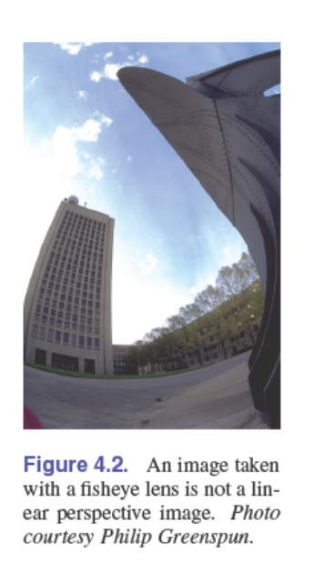
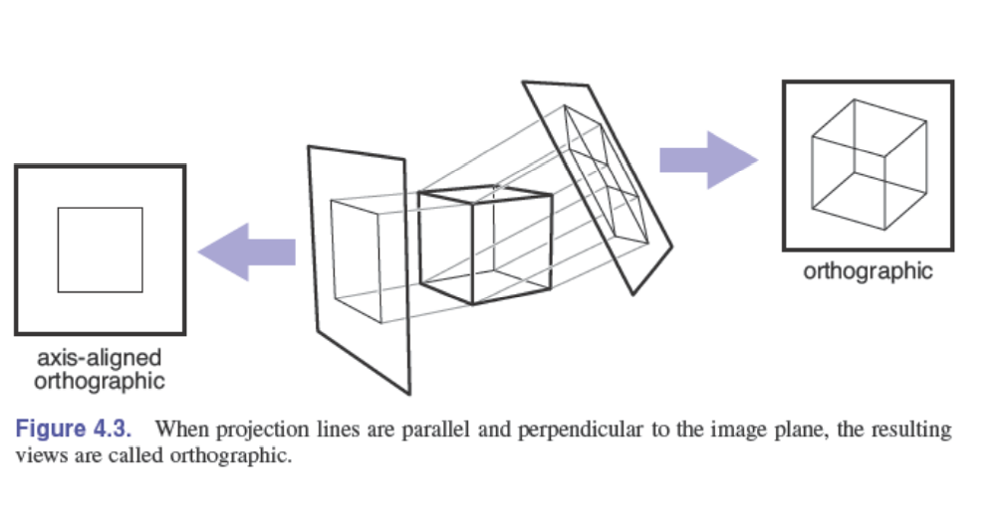
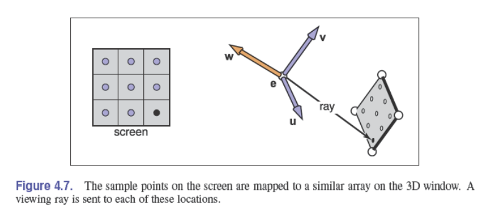
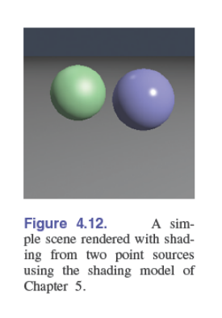

*边学边翻译，督促自己不能落下，同时也留点记忆*

# <center>**第四章 光线追踪**</center> 

***
&nbsp;&nbsp;&nbsp;&nbsp; 渲染三维对象是计算机图形学的基本任务之一，给一个由很多几何物体组成的3D空间场景，从指定的观察视角，计算出一张可见的场景空间的平面图片。多个世纪以来，建筑师和工程师也在做着类似的工作，他们通过绘制图纸来传达设计。
&nbsp;&nbsp;&nbsp;&nbsp; 从根本上说，渲染是一个将一组对象作为其输入，并产生一组像素作为其输出的过程。从某种方式来看，渲染就是计算每个物体对每个像素做出的贡献。通常以两种方式进行组织:在对象顺序渲染中，依次考虑每个对象，找到所有受影响的像素并更新。在图像顺序渲染中，依次考虑每个像素，找到影响它的所有对象并计算像素值。你可以考虑循环嵌套方面的差异：在对象顺序渲染中，“每个对象”循环在外部。而在图像顺序渲染中，“每个像素”循环在外部。
&nbsp;&nbsp;&nbsp;&nbsp; 基于图像顺序和基于对象顺序的渲染方法可以计算完全相同的图像，但各自适合计算不同类型的效果并且具有完全不同的性能特征。讨论完这两种方法后，我们将在第9章中探讨这些方法的比较优势，但是，从广义上讲，图像顺序渲染更容易工作,可以产生的更灵活的效果，并且通常（尽管并非总是如此）需要更多的执行时间来生成类似的图像。
&nbsp;&nbsp;&nbsp;&nbsp; 光线追踪是一种用于渲染3D场景的图像顺序算法，我们将优先考虑它，因为在不开发任何用于对象顺序渲染的数学机制的情况下，光线追踪器就能工作。

***
### 4.1 光线追踪基本算法
&nbsp;&nbsp;&nbsp;&nbsp; 光线追踪的工作原理是一次计算一个像素，对于每个像素，基本任务是找到在图像中该像素位置看到的对象。每个像素“看”的方向不同，像素看到的任何对象都必须与观察光线相交，这是一条从视点沿像素看的方向发出的线。我们想要的特定对象是与距离摄影机最近的观察光线相交的对象，因为它会阻挡后面任何其他对象的视图。找到该对象后，着色计算将使用交点、曲面法线和其他信息（取决于所需的渲染类型）来确定像素的颜色。这如图4.1所示，其中光线与两个三角形相交，但只有第一个三角形T2被命中并且被着色。
&nbsp;&nbsp;&nbsp;&nbsp; 因此，基本光线跟踪器有三个部分：

+ 光线生成，计算每个像素在相机空间下，观察光线的原点和方向。
+ 光线相交，查找与观察光线相交的最近的物体。
+ 着色，根据相交结果，计算像素点的颜色
  
&nbsp;&nbsp;&nbsp;&nbsp;光线追踪的基本流程如下：
~~~
for each pixel do
 conpute viewing ray
 find first object hit by ray and its surface normal n
 set pixel color to value computed from hit point ligts,and n
~~~
&nbsp;&nbsp;&nbsp;&nbsp;本章介绍光线生成、光线相交和着色的基本方法，这些方法足以实现简单的演示光线跟踪器。对于一个真正有用的系统，需要添加第12章中更有效的光线相交技术,加上第14章中更高级渲染技术,此时光线跟踪器的潜力才能真正发挥出来。

***
### 4.2 视角
&nbsp;&nbsp;&nbsp;&nbsp;在计算机出现之前的几百年，艺术家们就已经研究过用二维图形或绘画来表现三维物体或场景的问题。比如照片用2D图像表示3D场景。尽管有许多非传统的图像制作方法，从立体派绘画到鱼眼镜头（图4.2）再到外围摄像头，但艺术和摄影以及计算机图形学的标准方法都是线性透视，将三维对象投影到图像平面上，使场景中的直线成为图像中的直线。

&nbsp;&nbsp;&nbsp;&nbsp;最简单的投影类型是平行投影，在平行投影中，通过沿投影方向移动3D点，直到它们到达图像平面，从而将3D点映射到2D（图4.3–4.4）。生成的视图由投影方向和图像平面的选择决定。如果图像平面垂直于视图方向，则投影称为正交投影；否则称为斜向。

&nbsp;&nbsp;&nbsp;&nbsp;平行投影通常用于机械和建筑图形，因为它们保持平行线平行，并保留平行于图像平面的平面对象的大小和形状。
&nbsp;&nbsp;&nbsp;&nbsp;平行投影的优点也是它的局限性。在我们的日常经验中（在照片中更是如此），物体越远看起来越小，因此，后退到远处的平行线看起来并不平行。这是因为眼睛和照相机不会从单一的观察方向收集光线；它们收集通过特定视点的光线。正如文艺复兴以来的艺术家所认识到的那样，我们可以使用透视投影产生自然景观：我们只是沿着穿过一个点的线投影，即视点，而不是沿着平行线投影（图4.4）。这样，距离视点较远的对象在投影时自然会变小。透视视图由视点（而不是投影方向）和图像平面的选择决定。与平行视图一样，有倾斜和非倾斜透视视图；根据图像中心的投影方向进行区分。
&nbsp;&nbsp;&nbsp;&nbsp;您可能已经了解了三点透视的艺术惯例，这是一个手动构建透视图的系统（图4.5）。透视图的一个重要事实是，如果我们遵循透视图背后的简单数学规则，透视图的所有规则都将自动遵循：对象直接投影到眼睛，并在眼睛前面的视图平面处绘制。

***
### 4.3 计算视角射线
&nbsp;&nbsp;&nbsp;&nbsp;从上一节开始，光线生成的基本工具是视点（或平行视图的视图方向）和成像平面。有很多方法可以计算出相机几何体的细节；在本节中，我们将解释一种基于正交基的方法，该方法支持法线、倾斜平行视图和正交视图。
&nbsp;&nbsp;&nbsp;&nbsp;我们首先需要光线的数学表示方式。射线实际上只是一个原点和一个传播方向，这可以使用三维参数化线进行表达。如第2.7.7节所述，从眼睛e到图像平面上点s（图4.6）的3D参数线如下所示：
$$p
(t)=e+(s-e)
$$
&nbsp;&nbsp;&nbsp;&nbsp;这应该被解释为，我们从e沿着向量（s-e）前进一个距离t以找到点p。所以给定t，我们可以确定点p。点e是光线的原点，s-e是光线的方向。
&nbsp;&nbsp;&nbsp;&nbsp;注意p(0)=e, p(1)=s ，更一般地说，如果0< t~1~< t~2~，那么p(t~1~)比p(t~2~)更靠近眼睛。同样，如果t<0，那么p(t)在眼睛后面。当我们搜索不在眼睛后面的光线击中的最近物体时，这些将非常有用。
&nbsp;&nbsp;&nbsp;&nbsp;在代码中，通常使用一种存储位置和方向的结构或物体来表示光线。比如，在面向对象程序中，我们使用Vec3类表示一个三维向量，该类可进行常用的算法计算。
```
    class Ray
        Vec3 o |ray origin
        Vec3 d |ray direction
        Vec3 evaluate(real t)
        return o+td
```
&nbsp;&nbsp;&nbsp;&nbsp;为了计算视线，我们需要知道e(已知)和s。看上去很难确定s点，实际上能很直接的求出来。
&nbsp;&nbsp;&nbsp;&nbsp;所有的光线生成方法都是从一个称为相机系统的正交坐标系开始的，我们用e表示视点，用u、v和w表示三个基向量，u指向右（从相机方向看），v指向上，w指向后，这样{u，v，w}形成右手坐标系。构造相机系统最常用的方法是从视点（e）出发、视图方向（-w）和向上方向向量开始，使用第2.4.7节中描述的从两个向量构造正交基的过程××××××××××××××××××××××××××

#### 4.3.1 正交视图
&nbsp;&nbsp;&nbsp;&nbsp;对于正交视图，所有光线的方向都为-w。即使平行视图本身没有视点，我们仍然可以使用摄影机的原点来定义光线开始的平面，以便对象可能位于摄影机后面。
&nbsp;&nbsp;&nbsp;&nbsp;观察光线应从点e和向量u和v定义的平面开始；还需要的剩余信息是图像在飞机上的位置。我们将用四个数字定义图像尺寸，l和r是图像左右边缘的位置，从e沿u方向测量；b和t是图像的下边缘和上边缘的位置，从e沿v方向测量。通常l < 0 < r，b < 0 < t（见图4.9a）。
&nbsp;&nbsp;&nbsp;&nbsp;在第3.2节中，我们讨论了图像中的像素坐标。为了将具有$n_x *n_y$像素的图像适配到大小为（r-l）×（t-b）的矩形中，像素在水平方向上间隔$(r-l)/n_x$距离，在垂直方向上间隔$（t-b）/n_y$距离，边缘周围有半个像素空间，以使像素网格在图像矩形内居中。这意味着光栅图像中位置（i，j）处的像素具有：
$$
\begin{align}
u=l+(r−l)(i+0.5)/n_x \tag{1}\\
v=b+(t−b)(j+0.5)/n_y \tag{2}
\end{align}
$$
&nbsp;&nbsp;&nbsp;&nbsp;其中（u，v）是相对于原点e和基{u，v},像素在图像平面上的坐标。
&nbsp;&nbsp;&nbsp;&nbsp;在正交视图中，我们可以简单地使用像素的图像平面位置作为光线的起点，并且我们已经知道光线的方向就是视图方向。生成正交观察光线的步骤如下：
```
    compute u and v using(4.1)
    ray.direction = -w
    ray.origin = e+uu+vv
```
&nbsp;&nbsp;&nbsp;&nbsp;制作一个倾斜平行视图非常简单：只需将图像平面法线w与视图方向d分开指定即可。然后，程序完全相同，但用d代替-w。当然，w仍然用于构造u和v。
#### 4.3.2 透视视图
&nbsp;&nbsp;&nbsp;&nbsp;对于透视视图，所有的光线在视点处都有相同的原点;每个像素的方向是不同的。像平面不再位于e处，而是在e的前方d处;这个距离就是像平面距离，通常称为焦距，因为选择d和在真实相机中选择焦距的作用是一样的。每个射线的方向由视点和像素在像面上的位置定义。这种情况如图4.9所示，得到的过程与正交视图相似:
```
    compute u and v using (4.1)
    ray.o ← e
    ray.d ← −d w + u u + v v
```
&nbsp;&nbsp;&nbsp;&nbsp;像平行投影一样，斜透视投影能通过指定成像平面法线和投影方向来确定。

***
### 4.4 光线与物体的相交
&nbsp;&nbsp;&nbsp;&nbsp;生成光线r=e+td后，接着要在t>0的范围内，找到第一个相交的物体。实际中，它转换成了一个更一般的问题：在光线起点和一个在t时候（t在[$t_0,t_1$]之间）平面找到第一个交点。基本的光线相交算法里，$t_0= 0,t_1 = {\infty}$。我们先解决球面和三角形的相交。在下一节，将讨论更多形状物体的解法。
#### 4.4.1 光线与球相交
&nbsp;&nbsp;&nbsp;&nbsp;给定一个射线p(t) = e + td 以及一个隐式曲面f(p)=0 （见2.7.3节) ，我们想知道它们在哪里相交。当光线上的点满足隐式方程时，交点就会出现，我们寻求的t就是求程的解：
$$
\begin{aligned}
f(p(t))=0 
\end{aligned}
$$
&nbsp;&nbsp;&nbsp;&nbsp;或者 
$$
\begin{aligned}
f(e+td)=0 
\end{aligned}
$$
&nbsp;&nbsp;&nbsp;&nbsp;一个圆心为C=(x~c~,y~c~,z~c~)，半径为R的圆可使用下面隐式公式表示：
$$
\begin{aligned}
(x - x_{c})^{2}+(z - z_{c})^{2}+(z - z_{c})^{2}=0 
\end{aligned}
$$
&nbsp;&nbsp;&nbsp;&nbsp;也可以用向量形式表示：
$$
\begin{aligned}
(P-C)*(P-C)-R^2=0 
\end{aligned}
$$
&nbsp;&nbsp;&nbsp;&nbsp;所有满足方程的点都在圆表面上。如果我们把射线p(t)=e+td代入上述方程，就会得到一个关于t的参数方程:
$$
\begin{matrix}
(e + td − c) · (e + td − c) − R^2 = 0
\end{matrix}
$$
&nbsp;&nbsp;&nbsp;&nbsp;展开公式得：
$$
\begin{matrix}
(d · d)t2 + 2d · (e − c)t + (e − c) · (e − c) − R^{2} = 0
\end{matrix}
$$
&nbsp;&nbsp;&nbsp;&nbsp;这里，除了参数t，其他都是已知的，所有，这是个经典的关于t的二次方程：
$$
\begin{matrix}
At^{2} + Bt + C = 0
\end{matrix}
$$
&nbsp;&nbsp;&nbsp;&nbsp;在2.2节，我们讨论了这个方程的解法。二次解中平方根符号下的项$B^{2} - 4AC$ 被称为判别式，它告诉我们有多少个真正的解。如果判别式为负，则其平方根为虚，且直线和球体不相交。如果判别式为正，则有两种解决方案：一种是光线进入球体，另一种是光线离开球体。如果判别式为零，则光线将擦过球体，并恰好在一个点接触它。对上式求解：
&nbsp;&nbsp;&nbsp;&nbsp;在实际计算中，您应该首先检查判别式的值，然后再计算其他项。要正确找到区间[$t_0, t_1$]中最近的交点，有三种情况:如果两个解中较小的解在区间内，则为第一个命中;否则，如果较大的解在区间内，它是第一个命中的解;否则，就没有交点。
&nbsp;&nbsp;&nbsp;&nbsp;如2.7.4节所述，点p处的法向量由梯度n=2(p-c)给出，单位向量为(p-c)/R。
#### 4.4.2 光线与三角形相交
&nbsp;&nbsp;&nbsp;&nbsp;计算光线与三角形相交有很多方法。我们将介绍使用重心坐标，对包含三角形的参数化平面进行求解的方法，这种方法除了要保存三角形顶点外，其他数据都不需要长期保存（Snyder&Barr，1987）。
&nbsp;&nbsp;&nbsp;&nbsp;为计算光线与一个参数化平面相交，先在笛卡尔坐标系下建立一组方程：
$$
\left.
\begin{matrix}
    x_e + tx_d = f(u,v) \\
    y_e + ty_d = g(u,v) \\
    z_e + tz_d = h(u,v) 
\end{matrix}
\right\}
\quad or, e + td = f(u,v).
$$
&nbsp;&nbsp;&nbsp;&nbsp;方程组中，有三个等式和三个未知数。表面是参数化平面，参数方程是线性时，如2.9.2所示，可以写成成矢量形式的。如果三角形的顶点是a,b,c,则相交点会发生在方程中三个参数t，b，r取一定值的时候。
$$
e+td=\alpha +\beta(b−a)+\gamma(c−a) \tag{4.2}
$$
&nbsp;&nbsp;&nbsp;&nbsp;解这个方程告诉我们两个东西，t：确定沿着光线与平面的交点，($\beta$,$\gamma$),确定交点与三角形的关系。交点p在e+td的方程上，而2.9.2节说，有且只有 $\beta$>0,$\gamma$>0,且 $\beta$+$\gamma$<1,交点才在三角形内。否则光线将打在三角形外的平面上，从而不与三角形相交。如果没有解，则平面退化了，或光线与平面平行。
&nbsp;&nbsp;&nbsp;&nbsp;为了求未知数t，$\beta$，$\gamma$，我们把公式4.2从向量形式展开成三个坐标的三个方程：
$$
\begin{matrix}
    x_e + tx_d = x_a+\beta(x_b-x_a)+\gamma(x_c-x_a),\\
    y_e + ty_d = y_a+\beta(y_b-y_a)+\gamma(y_c-y_a),\\
    z_e + tz_d = z_a+\beta(z_b-z_a)+\gamma(z_c-z_a) \\
\end{matrix}
$$
&nbsp;&nbsp;&nbsp;&nbsp;公式可被改写为矩阵形式：
$$
\begin{bmatrix}
    x_a - x_b & x_a - x_c  & x_d \\
    y_a - y_b & y_a - y_c  & y_d \\
    z_a - z_b & z_a - x_c  & z_d 
\end{bmatrix}
\begin{bmatrix}
    \alpha \\
    \beta \\
    \gamma 
\end{bmatrix} = 
\begin{bmatrix}
    x_a - x_e \\
    y_a - y_e \\
    z_a - z_e 
\end{bmatrix}
$$ 
&nbsp;&nbsp;&nbsp;&nbsp;求解这个3×3线性系统最快的经典方法是克拉默法则，解如下：
$$
\beta = 
\frac{\left|
\begin{array}{ccc} 
    x_a - x_e & x_a - x_c & x_d \\ 
    y_a - y_e & y_a - y_c & y_d \\ 
    z_a - z_e & z_a - z_c & z_d 
\end{array}
\right| }{|A|}
$$
$$
\gamma = 
\frac{\left|
\begin{array}{ccc} 
    x_a - x_b & x_a - x_e & x_d \\ 
    y_a - y_b & y_a - y_e & y_d \\ 
    z_a - z_b & z_a - z_e & z_d 
\end{array}
\right| }{|A|}
$$
$$
t = 
\frac{\left|
\begin{array}{ccc} 
    x_a - x_b & x_a - x_c & x_a - x_e \\ 
    y_a - y_b & y_a - y_e & y_a - y_e \\ 
    z_a - z_b & z_a - z_e & z_a - z_e 
\end{array}
\right| }{|A|}
$$
&nbsp;&nbsp;&nbsp;&nbsp;A矩阵为：
$$
A = 
\begin{bmatrix} 
    x_a - x_b & x_a - x_c & x_d \\ 
    y_a - y_b & y_a - y_e & y_d \\ 
    z_a - z_b & z_a - z_e & z_d 
\end{bmatrix}
$$
&nbsp;&nbsp;&nbsp;&nbsp;|A|为矩阵A的行列式，3×3行列式具有可利用的公共子项。参考下列的矩阵公式：
$$
\begin{bmatrix}
    a & d  & g \\
    b & e  & h \\
    c & f  & i
\end{bmatrix}
\begin{bmatrix}
    \alpha \\
    \beta \\
    \gamma 
\end{bmatrix} = 
\begin{bmatrix}
    j \\
    k \\
    l 
\end{bmatrix}
$$ 
&nbsp;&nbsp;&nbsp;&nbsp;克拉默法则给出了结果：
$$
\beta = 
\frac{j(ei-hf)+k(gf-di)+l(dh-eg)}{M}
$$
$$
\gamma = 
\frac{i(ak-jb)+h(jc-al)+g(bl-kc)}{M}
$$
$$
t = 
\frac{f(ak-jb)+e(jc-al)+d(bl-kc)}{M}
$$
&nbsp;&nbsp;&nbsp;&nbsp;其中：
$$
M = a(ei-hf)+b(gf-di)+c(dh-eg).
$$
&nbsp;&nbsp;&nbsp;&nbsp;我们也可以充分利用一些项（比如ei-hf）来减少计算量
&nbsp;&nbsp;&nbsp;&nbsp;光线与三角形的相交算法中，我们使用线性算法，以便提前结束算法。因此，函数应该写成：
```
boolean raytri (Ray r, vector3 a, vector3 b, vector3 c,interval [t0, t1])
    compute t
    if (t<t0) or (t>t1) then
        return false
    compute γ
    if (γ < 0) or (γ > 1) then
        return false
    compute β
    if (β < 0) or (β > 1 − γ) then
        return false
    return true
```
#### 4.4.3 软件中的光线追踪
&nbsp;&nbsp;&nbsp;&nbsp;在光线追踪程序中，通常使用面向对象的设计方法，一个父类（比如叫Surface），任何可以被光线碰撞相交的物体，包括曲面组或优化结构（如Triangle,Sphere)，都应该是Surface的子类。追踪程序应该持有一个指向整个模型的Surface引用，这样就能很方便的添加新类型的物体和优化结构。
&nbsp;&nbsp;&nbsp;&nbsp; Surface 类的关键接口是一个与光线相交计算的方法 (Kirk & Arvo, 1988)。
```
    class Surface
        HitRecord hit(Ray r, real t0, real t1
```
($t_0$, $t_1$)是光线相交检测的区间，HitRecord是一个持有曲面相交数据的类，这些数据随后将被使用。
```
    class HitRecord
        Surface s | surface that was hit
        real t | coordinate of hit point along the ray
        Vec3 n | surface normal at the hit point
        ...
```
&nbsp;&nbsp;&nbsp;&nbsp;曲面被击中后，t和该点的曲面法线是必需的，其他数据比如纹理坐标，正切向量也要保存。根据语言的不同，相交结果可以从函数中返回，也可以通过引用返回。当t=$\infty$时,光线和曲面没有相交。
#### 4.4.5 与一组对象相交
&nbsp;&nbsp;&nbsp;&nbsp;大多场景都有很多物体组成，当我们检测光线与场景相交时，只要发现离相机最近的相交点就可以了。最简单的方法就是把这一系列的物体看成一个另外类型的物体。为了检测光线与这组物体相交，我们只要检测光线与物体组中的每一个物体，计算出最小的t。下面的代码在区间[$t_0,t_1$]中最近的检测
```
    class Group, subclass of Surface
        list-of-Surface surfaces | list of all surfaces in the group
        HitRecord hit(Ray ray, real t0, real t1)
            HitRecord closest-hit(∞) | initialize to indicate miss
            for surf in surfaces do
                rec = surf.hit(ray, t0, t1)
                if rec.t < ∞ then
                closest-hit = rec
                t1 = t
            return closest-hit
```
&nbsp;&nbsp;&nbsp;&nbsp;注意上面的代码会缩小检测范围[$t_0,t_1$]，使得surf.hit函数只检测比最小值还小的面。 
&nbsp;&nbsp;&nbsp;&nbsp;一旦光线与场景相交算法执行完成，我们解可以渲染如图4.11的图片了，是更好的结果依赖随后讨论的更多的可视化因素。

***
### 4.5 着色
&nbsp;&nbsp;&nbsp;&nbsp;获取像素的可见表面后，就可以通过着色模型来计算每个像素的值。如何做到这一点取决于应用程序的方法，范围从简单的启发式方法到复杂的基于物理的模型。完全相同的着色模型可以用于光线跟踪或对象顺序渲染方法。
&nbsp;&nbsp;&nbsp;&nbsp;第五章描述了一个简单的阴影模型，它适用于基本的射线跟踪器，也是我们在本章中用来制作渲染图的模型。第14章讨论讨论了更多的模型，这些模型更贴近真实表面的物理。在本节，我们将讨论射线追踪器如何计算着色的输入。
#### 4.5.1 光源
&nbsp;&nbsp;&nbsp;&nbsp;为了支持着色，光线跟踪程序总是有一系列光源。在第5章的着色模型中，我们需要三种光源:点光源，从空间的一点发出光；方向光源，从一个方向照亮场景，环境光源，提供恒定的照明来填补阴影。在更高级的系统中，还支持其他类型的光，如区域光(即发出光是一个几何图形)或环境光(使用图像表示来自遥远的光，如天空)。
&nbsp;&nbsp;&nbsp;&nbsp;从一个点或方向光源计算着色需要一定的几何信息，在射线示踪器中，当观察射线被确定击中表面后，我们确定了四个向量:
+ 着色点x,通过在视线方向的时间t计算。
+ 表面法线n，依赖表面类型，每个表面都可以计算光线碰撞点的法线。
+ 光的方向l，由光源位置或者方向计算，作为了着色的一部分。
+ 观察方向v，用观察射线的反方向(v = −d/||d||表示。

&nbsp;&nbsp;&nbsp;&nbsp;来自环境光源的着色，要更简单:没有l，因为光来自任何地方;着色不依赖于v;对于第五章的简单模型，它甚至不依赖于x或n。
&nbsp;&nbsp;&nbsp;&nbsp;在包含多个灯光的场景中计算着色，只是简单地将灯光的贡献相加。在基本的射线跟踪器中，可以简单地遍历所有光源，计算每个光源的着色，并将结果累积为像素颜色。
#### 4.5.2 实现着色
&nbsp;&nbsp;&nbsp;&nbsp;光线追踪程序通常包含代表光源和材料的物体。光源可以是Light类的子类的实例，它们必须包括足够的信息，以充分描述光源。由于着色也需要描述表面材质的参数，另一个有用的类是material，它封装了需要着色模型的一切信息。
&nbsp;&nbsp;&nbsp;&nbsp;不同的系统采用不同的方法来分解光线和材料之间的着色计算。本章介绍的一种方法是让灯负责整体照度的计算，让材质负责BRDF值的计算。这种设置中，类的接口可能如下：
```
    class Light
        Color illuminate(Ray ray, HitRecord hrec)
    class Material
        Color evaluate(Vec3 l, Vec3 v, Vec3 n)
```
&nbsp;&nbsp;&nbsp;&nbsp;每个表面将存储对其材质的引用。通过这种方式，点光照明可能实现如下:
```
    class PointLight, subclass of Light
        Color I
        Vec3 p
        Color illuminate(Ray ray, HitRecord hrec)
            Vec3 x = ray.evaluate(hrec.t)
            real r = ||p − x||
            Vec3 l = (p − x)/r
            Vec3 n = hrec.normal
            Color E = max(0, n · l) I/r2
            Color k = hrec.surface.material.evaluate(l, v, n)
            return kE
```
&nbsp;&nbsp;&nbsp;&nbsp;这些计算假设Color类持有一个颜色的RGB组件，并支持组件乘法。通过设置环境系数设置为材质的属性，将环境照明作为了光源:
```
    class AmbientLight, subclass of Light
        Color Ia
        Color illuminate(Ray ray, HitRecord hrec)
            Color ka = hrec.surface.material.ka
            return kaIa
```
&nbsp;&nbsp;&nbsp;&nbsp;一条光线的完整着色，包括相交检测和处光源，可像下面那样：
```
    function shade-ray(Ray ray, realt0,realt1)
    HitRecord rec = scene.hit(ray,t0,t1)
    if rec.t< $\infty$ then
        Colr c = 0
        for light in scene.lights do
            c= c+light.illuminate(ray,rec)
        return c 
    else 
        return background-color
```
&nbsp;&nbsp;&nbsp;&nbsp;这种设置能保持材质和灯光彼此分离，方便随后独立的加入新的材质和光源。贴图可能增加光线追踪器的复杂性，具体可见11.2.5节。
&nbsp;&nbsp;&nbsp;&nbsp;着色使得3D物体看起来更真实和更加可理解，但是它没有展现与其他物体的交互。比如，图4.12中的圆，看上去像浮在地板上面。

#### 4.5.3 阴影
&nbsp;&nbsp;&nbsp;&nbsp; 一旦你在光线跟踪器中有了基本的阴影，点和方向光的阴影可以很容易地添加。如果我们想象自己在一个被阴影遮蔽的表面上的x点上，如果我们“看向”光源，看到我们和光源之间的物体，这个点就在阴影中。如果中间没有物体，那么光线就不会被阻挡。
&nbsp;&nbsp;&nbsp;&nbsp;如图4.13所示，射线x +tl没有击中任何物体，因此点x不在阴影中。另一方面，点x'处于阴影中，因为射线x' + tl'确实击中了一个物体。决定在阴影内或阴影外的光线被称为阴影光线，以区别于观察光线。
&nbsp;&nbsp;&nbsp;&nbsp;为了获得阴影算法，我们向从光源添加阴影的代码中添加if语句，以首先确定光线是否被阴影遮蔽。在一个简单的实现中，阴影射线将检查$t\in[0, r]$，但由于数值不精确，这可能导致与p所在的表面相交。相反，为了避免这个问题，通常的调整是测试$t\in[\epsilon,r]$，其中$\epsilon$是一个小的正常数(图4.14)。
&nbsp;&nbsp;&nbsp;&nbsp;可以将阴影测试添加到PointLight方法中。通过跟踪阴影射线并添加条件来照亮上图:
```
    HitRecord srec = scene.hit(ray(x,l),\epsion,r)
    if srec.t< $\infty$ then
        proceed with normal illumination calculation
    else 
        return 0|shading point is in shadow
```
&nbsp;&nbsp;&nbsp;&nbsp;方向光的阴影测试差类似，但t~1~为$\infty$而不是r。每一个光源的光照阴影计算需要一个独立的阴影光线，但是环境着色中没有阴影测试。
&nbsp;&nbsp;&nbsp;&nbsp;阴影在展示邻近物体的管线中，起到一个很重要的角色，效果可见图4.15.
#### 4.5.3 镜面反射
&nbsp;&nbsp;&nbsp;&nbsp;将理想的镜面反射添加到光线追踪程序中是很简单的。关键的观察如图4.16所示，从e方向观看的人看到的是从表面看到的r方向。向量r是向量-d在平面法线n上的反射，可以用d在平面法线方向上的投影来计算:
$$
R =d - 2(d - n)n \tag{4.3}
$$
&nbsp;&nbsp;&nbsp;&nbsp;在现实世界中，当光从表面反射时，会损失一些能量，而这种损失对于不同的颜色是不同的。例如，金色比蓝色更有效地反射黄色，所以它会改变它反射的物体的颜色。这可以通过在着色光线中添加一个递归调用来实现，在所有的光都被计入后添加一个贡献
$$
color c = c + k_mshadow - Ray(Ray(p, r),E,\infty)
$$
&nbsp;&nbsp;&nbsp;&nbsp;其中$k_m$(“镜像反射”)是镜面RGB颜色。我们需要确保传递到$t_0$=e的原因与我们对阴影射线做的相同;我们不希望反射光线击中产生它的物体。
&nbsp;&nbsp;&nbsp;&nbsp;上面的递归调用的问题是它可能永远不会终止。例如，如果一条光线从房间内开始，它将永远反弹。这可以通过添加最大递归深度来解决。如果只在k~m~不为零的情况下生成反射射线，代码将更有效。
&nbsp;&nbsp;&nbsp;&nbsp;使用恒定的镜面反射系数k~m~可以给出简单射线示踪器的特殊外观特征(图4.17);在现实世界中，这个系数根据入射角的不同而有很大的变化。更好的模型见第14章。

***
### 4.6 历史回顾
&nbsp;&nbsp;&nbsp;&nbsp;光线追踪是在计算机图形学的早期发展起来的（Appel，1968），但直到有足够的计算能力可用时才被广泛使用（Kay&Greenberg，1979；Whitted，1980）。
&nbsp;&nbsp;&nbsp;&nbsp;光线跟踪的发展历程比对象顺序渲染更清晰（Snyder&Barr，1987；Muuss，1995；S.Parker等人，1999；Wald，Slusallek，Benthin和Wagner，2001）。尽管它传统上被认为是一种离线方法，但实时光线跟踪正变得越来越普遍。

***
### FAQ
* 为什么光线跟踪中没有透视矩阵？
&nbsp;&nbsp;&nbsp;&nbsp;z缓冲区中存在透视矩阵，因此我们可以将透视投影转换为平行投影。这在光线跟踪中是不需要的，因为通过从眼睛发出光线，可以很容易地隐式地进行透视投影。
* 光线跟踪可以进行交互吗？
&nbsp;&nbsp;&nbsp;&nbsp;对于足够小的模型和图像，任何现代PC都具有足够的强大功能，光线跟踪可以进行交互。实际上，全屏实现需要多个具有共享帧缓冲区的CPU。计算机功率的增长速度远远快于屏幕分辨率，而传统的PC机能够以屏幕分辨率对复杂场景进行光线跟踪只是时间问题。
* 光线跟踪在硬件图形程序中有用吗？
&nbsp;&nbsp;&nbsp;&nbsp;光线跟踪常用于拾取。当用户在3D图形程序中的像素上单击鼠标时，该程序需要确定该像素内可见的对象。光线跟踪是确定这一点的理想方法。

***
### 练习题

+ 1、射线(1,1,1)+t(−1,−1,−1)与以原点为圆心半径为1的球的交点的射线参数是什么? 注意:这是一个很好的调试案例。
+ 2、当射线(1,1,1)+t(−1,−1,−1)击中顶点为(1,0,0)，(0,1,0)和(0,0,1)的三角形时，质心坐标和射线参数是什么?注意:这是一个很好的调试案例。
+ 3、对“良好”(非对抗性)模型上的射线跟踪的近似时间复杂度做一个包络计算。将您的分析拆分为预处理和计算，可以预测一个静态模型的光线跟踪多帧的行为。
